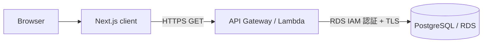

# Canvas 設計書

## 1. 目的

写真、説明、日付を memory post として保存し、album 単位で閲覧できる構成を定義する。

## 2. システム構成



- フロントエンドは Next.js App Router のサーバーコンポーネントから API を呼び出す。
- バックエンドは Rust Lambda として動作する。
- Lambda は起動時に DB 接続プールを作成し、リクエスト間で共有する。
- DB 接続は RDS IAM 認証トークンと同梱の CA 証明書を用いた TLS を使用する。

## 3. リポジトリ構成

```text
client/                    Next.js アプリケーション
server/                    Rust workspace
  canvas-albums/           album API Lambda
docs/                      設計書・仕様書
.github/workflows/         CI、security audit、deploy
```

## 4. フロントエンド設計

- `app`: URL とページを定義する。
- `components`: 表示責務を持つ再利用可能な UI。
- `lib/api`: 型付き API クライアント。
- `lib/fetchMemories`: API 呼び出しと fallback の境界。
- `types`: バックエンド JSON と対応する TypeScript 型。

API が失敗した場合は `withFallback` が fallback データを返す。これにより API 未接続でも画面の開発ができる一方、運用時はログで取得失敗を確認できる。

## 5. バックエンド設計

`main.rs` は Lambda runtime の起動、DB pool の初期化、pool の共有を担当する。`http_handler.rs` は以下を担当する。

1. API Gateway の path parameter から `id` を取得
2. album の存在確認
3. album に紐づく posts の取得
4. camelCase JSON へのシリアライズ
5. HTTP ステータスとエラー応答の生成

SQL は ID を text に変換して比較・返却するため、文字列 ID と UUID のどちらにも対応しやすい形にしている。

## 6. データモデル

```text
albums 1 ─── * posts

albums
  id
  title

posts
  id
  album_id -> albums.id
  image_path
  description
  date
```

album と post の参照整合性は DB の外部キーで保証する。投稿取得順は `date DESC, id` とする。

## 7. デプロイ設計

`main` への push で GitHub Actions が起動する。Rust CI と security audit が成功した後、Cargo Lambda で workspace を release build し、各 binary を Lambda にデプロイする。AWS 認証は GitHub Actions の設定済み認証情報を使用する。

## 8. 今後の拡張

- album 一覧、highlight、posts 一覧 API の実装
- upload API と S3 などの画像ストレージ連携
- 認証・認可
- DB migration の導入
- API の OpenAPI 定義
